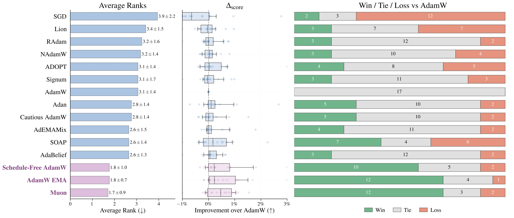

# Benchmarking Optimizers for Tabular MLPs

:scroll: [arXiv](https://arxiv.org/abs/2604.15297)
&nbsp; :books: [Other tabular DL projects](https://github.com/yandex-research/rtdl)

This is the official repository of the paper "Benchmarking Optimizers for Tabular MLPs". 

The README has instructions on:

- [**Using Muon and EMA in Practice**](#using-muon-and-ema-in-practice)
- [**Reproducing Paper Results**](#reproducing-paper-results)

## Benchmark Results

We benchmark 15 optimizers on 17 tabular datasets for training MLPs and MLP-based Models. We find that <strong>Muon consistently outperforms AdamW</strong>. We aslo highlight AdamW with Exponential Moving Average (EMA) of model weights as a simple way to improve AdamW on plain MLPs, though its effect is less consistent for advanced MLP-based models. 

Read the [paper](https://arxiv.org/abs/2604.15297) for a deeper overview of the benchmark and results

<p align="center">

</p>
<table>
<tr>
<td></td>
</tr>
<tr>
<td><sub><strong>Figure 1 from the paper</strong>. The left column shows average ranks of optimizers (lower is better). The middle shows average improvement over the AdamW baseline. The right most part shows wins ties and losses against AdamW.</sub></td>
</tr>
</table>

## Using Muon and EMA in Practice

This section provides a practical recipe for using Muon and EMA in tabular deep learning pipelines.

The examples below use:
- [`tabm`](https://github.com/yandex-research/tabm) for MLP-style tabular backbones
- [`rtdl_num_embeddings`](https://github.com/yandex-research/rtdl-num-embeddings) for numerical feature embeddings
- [`Muon`](https://github.com/KellerJordan/Muon) for the optimizer

If you use `uv`, you can install everything with:

```sh
uv add tabm rtdl-num-embeddings git+https://github.com/KellerJordan/Muon
```

For EMA, you do not need any extra package: PyTorch already provides the necessary utilities via
[`torch.optim.swa_utils`](https://docs.pytorch.org/docs/stable/generated/torch.optim.swa_utils.AveragedModel.html).

### Muon: Applying to Tabular MLP-based models

Muon should only be applied to hidden weights of the backbone; We  do not apply Muon to the output layer matrix and to feature embedding matrices. In the following snippet we provide a simple parameter groupping that can be used with pytorch tabular DL models, which are using MLP backbones (e.g. from [`tabm`](https://github.com/yandex-research/tabm)) and embeddings for numerical features from [`rtdl_num_embeddings`](https://github.com/yandex-research/rtdl-num-embeddings).

```python
import torch.nn as nn
import tabm
from muon import SingleDeviceMuonWithAuxAdam
from rtdl_num_embeddings import (
    LinearEmbeddings,
    LinearReLUEmbeddings,
    PiecewiseLinearEmbeddings,
    PeriodicEmbeddings,
)


def make_optimizer(
    model: nn.Module,
    *,
    lr: float = 3e-4,  # the lr values are arbitrary, you should most probably tune the lr
    weight_decay: float = 0.1,
    betas: tuple[float, float] = (0.9, 0.999),
    eps: float = 1e-8,
    muon_lr: float = 0.002, # same for the muon lr
):
    # Muon: matrix-like hidden weights of the backbone only.
    muon_params = set([
        module.weight
        for module in model.backbone.modules()
        if isinstance(module, nn.Linear) and 1 not in module.weight.shape[-2:]
    ])

    # Zero weight decay: biases, normalization layers, numerical embeddings.
    zero_wd_types = (
        nn.BatchNorm1d,
        nn.LayerNorm,
        nn.InstanceNorm1d,
        LinearEmbeddings,
        LinearReLUEmbeddings,
        PiecewiseLinearEmbeddings,
        PeriodicEmbeddings,
    )
    zero_wd_params = set([
        p
        for module in model.modules()
        for name, p in module.named_parameters()
        if name.endswith('bias') or isinstance(module, zero_wd_types)
    ])

    return SingleDeviceMuonWithAuxAdam([
        dict(
            params=list(muon_params),
            lr=muon_lr,
            momentum=muon_momentum,
            weight_decay=(weight_decay if muon_weight_decay is None else muon_weight_decay),
            use_muon=True,
        ),
        dict(
            params=[p for p in zero_wd_params if p not in muon_params],
            lr=lr,
            betas=betas,
            eps=eps,
            weight_decay=0.0,
            use_muon=False,
        ),
        dict(
            params=[
                p
                for p in model.parameters()
                if p not in muon_params and p not in zero_wd_params
            ],
            lr=lr,
            betas=betas,
            eps=eps,
            weight_decay=weight_decay,
            use_muon=False,
        ),
    ])
```

### Muon: Example Usage

Here is a sketch of how Muon could be used with the above `make_optimizer` function with a basic MLP with LinearReLU embeddings:

```python
import torch.nn as nn
import tabm
from rtdl_num_embeddings import LinearReLUEmbeddings


n_num_features = 24
d_embedding = 16
d_out = 1


class Model(nn.Module):
    def __init__(self):
        super().__init__()
        self.num_embeddings = LinearReLUEmbeddings(n_num_features, d_embedding)
        # this is a regular MLP backbone, just from the tabm package
        self.backbone = tabm.MLPBackbone( 
            d_in=n_num_features * d_embedding,
            n_blocks=3,
            d_block=512,
            dropout=0.1,
        )
        self.head = nn.Linear(512, d_out)

    def forward(self, x_num):
        x = self.num_embeddings(x_num).flatten(1)
        x = self.backbone(x)
        return self.head(x)


model = Model()
optimizer = make_optimizer(model, lr=3e-4, weight_decay=1e-4, muon_lr=0.02)
```

### EMA: basic example 

Exponential Moving Average (EMA) is easy to add and it can often provide improvements over plain AdamW for MLP models. 

To use PyTorch's built-in EMA utilities, during the model setup you can do:

```python
import torch
import tabm
from torch.optim.swa_utils import AveragedModel, get_ema_multi_avg_fn

model = Model() # can be the model from the above snippet
optimizer = torch.optim.AdamW(model.parameters(), lr=3e-4, weight_decay=1e-4)

ema_model = AveragedModel(
    model,
    multi_avg_fn=get_ema_multi_avg_fn(0.99),
)
```

Then update the EMA model after each optimizer step:

```python
for x, y in train_loader:
    optimizer.zero_grad()
    loss = loss_fn(model(x), y)
    loss.backward()
    optimizer.step()
    ema_model.update_parameters(model)
```

## Reproducing Paper Results

In this section we provide an overview of all necessary code, configs, results and notebooks needed to:

- Reproduce experiments (continue reading this document for instructions).
- Reproduce figures and tables from the paper (see [this section](#reproducing-paper-artifacts)).

### Repository layout

- `bin/` — scripts for tuning, evaluation, and model training
- `lib/` — shared utilities and notebook/result helpers
- `lib/optim/` — local optimizer wrappers/modifications used in the paper
- `vendor/` — vendored optimizer implementations kept close to upstream
- `exp/` — published experiment trees (`config.toml`, `report.json`)
- `notebooks/` — cleaned artifact notebook
- `assets/` — generated figure/table assets used by the paper and this README
- `tools/prepare_tabred.py` — helper for preparing the TabReD datasets

### Experiment layout

Each experiment directory stores the following artifacts:

```text
exp/<model>/<optimizer>/<...>/<dataset>/
  tuning/
    config.toml
    report.json
  evaluation/
    config.toml
    report.json
```

The files are:
- `config.toml` — experiment configuration;
- `report.json` — machine-readable results;

### Environment setup

We use uv for managing dependencies. Install [uv](https://docs.astral.sh/uv/getting-started/installation/) and on first setup run:

```bash
uv sync --managed-python
```

### Data setup

License terms remain those of the original datasets.

#### Step 1: default datasets

Download and unpack the non-TabReD datasets:

```bash
mkdir -p local data
wget https://huggingface.co/datasets/rototoHF/tabm-data/resolve/main/data.tar -O local/tabm-data.tar.gz
tar -xvf local/tabm-data.tar.gz -C data
```

#### Step 2: TabReD datasets

Download the TabReD benchmark to `local/tabred`, then prepare it:

```bash
uv run tools/prepare_tabred.py local/tabred data --force
```

### Examples: How to Reproduce Experiments

To illustrate the experiment workflow: here is a concrete example of how to reproduce the MLP Muon results on a churn dataset. This assumes you have uv and have downloaded the datasets into the project root into the `data` directory.

First we copy and reset the experiment. The experiment is either tuninig or an evaluation directory with a `config.toml` file. Thus to reproduce tuning with subsequent evaluation we need to copy a `tuning/config.toml` subtree we want to reproduce. You may do it like this:

```python
# can be run from shell with uv run python -c '... (the exact syntax depends on your shell)
import lib.experiment

dst = "local/exp/reproduce-mlp-muon/churn/tuning"
lib.experiment.copy("exp/mlp/muon/churn/tuning", dst)
lib.experiment.reset(dst)
```

Then you can use the `bin/go.py` utility to launch the experiments. 

To launch both tuning and evaluation on a newly created experiment, run:

```sh
# important to explicitly set the GPU you are using
export CUDA_VISIBLE_DEVICES=0
uv run bin/go.py local/exp/reproduce-mlp-muon/churn/tuning --resume --n-seeds 10
```

You can also launch tuning and evaluation separately with respective `tuning/config.toml` and `evaluation/config.toml` files with:

```sh
uv run bin/tune.py path/to/tuning # or...
# uv run bin/evalute.py path/to/evaluation
```

Same goes for the individual runs via `uv run bin/ffn.py path/to/exp`, but for this the relevant config needs to be created. Like this, for example:

```python
# can be run in shell with uv run python -c 
import lib.experiment

src = "exp/mlp/adamw-ema/tabred/delivery-eta/evaluation"
evaluation_config = lib.experiment.load_config(src))
config = {'seed': 0, **evaluation_config['base_config']}
lib.experiment.create('local/exp/adamw-ema-delivery-eta-single-seed', config=config, parents=True)
```

### Reproducing Paper Artifacts

To generate and play arround with artifacts generation, use the following notebook which runs top to bottom and generates all tables and figures used in the paper from `report.json` files in this repo:

```text
notebooks/make_artifacts.ipynb
```

The generated artifacts are stored in `assets/`
